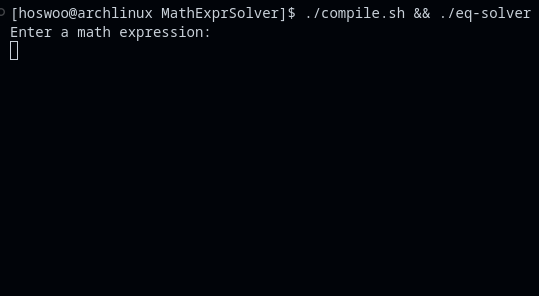

# MathExprSolver 
A simple C++ program that lexes and parses a mathematical expression string, and then calculates the result.

Uses the [shunting yard algorithm](https://en.wikipedia.org/wiki/Shunting_yard_algorithm) to parse input to be evaluated.

## Operators Supported
```
() Parenthesis
 ^ Exponent
 * Multiply
 / Divide
 + Addition
 - Subtraction
```

