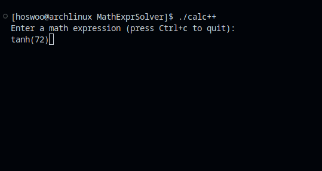

# MathExprSolver 
A C++ program that lexes and parses a mathematical expression string, and then calculates the result.

Uses the [shunting yard algorithm](https://en.wikipedia.org/wiki/Shunting_yard_algorithm) to parse input to be evaluated.

As of now, the syntax checker probably won't catch every error.

## Operators Supported
```
() Parenthesis
 ^ Exponent
 * Multiply
 / Divide
 + Addition
 - Subtraction
 % Modulo
```

## Constants Supported
```
e, pi
```

## Functions Supported
```
sin, cos, tan
csc, sec, cot

asin, acos, atan

asinh, acosh, atanh
sinh, cosh, tanh

log, ln, sqrt, abs

```

Note that you must parenthesize function parameters, i.e. cos(45).


